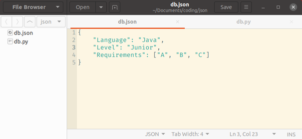
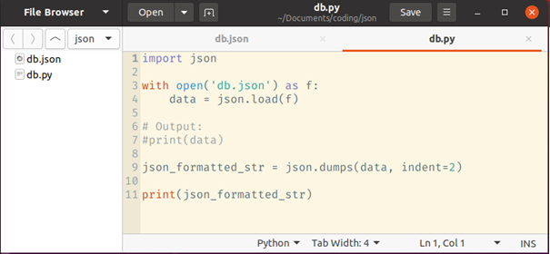
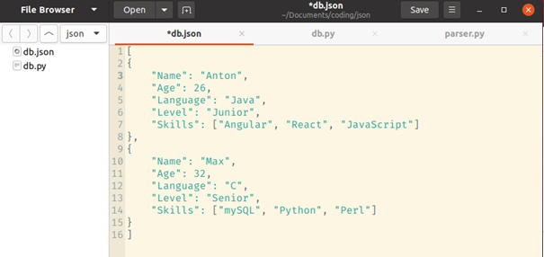

***
```python
printf("My developer diary.\n");
```
***

Because of the research I did in the past couple of days and feeling a little bit overwhelmed about the amount of tools available for developers a question question popped into my head: How do I differ between what I actually need in the future and what is just for experience?

Since I was currently looking into databases and jsons a bit, I had just the idea that would cover the answer to the above aswell as databases. A job site. Parse job sites for what developer skills are in demand and what repeats the most. I had heard so much about Python's webscraping capabilities and it was time to look at what I could do.

After spending a couple of hours on coming up with a solution in Python, I had a functioning web parser that would parse a specific job hunting website for it's very specific links which were all the same length of 36 and almost identical except for the last 6 digits. After I got that to work I wasn't sure what would be the  best way to save these parsed links as the ultimate goal was to visit each of these job links individually and again, parse them for key words regarding development. The idea to link individual job titles to certain programming languages and the job requirements in order to create some form of statistic sprung to life. Hence why I was looking for a way to best safe those links as I would preferrably only use them once. Only that with future parsing, I would probably have to have some form of double check whether I had already parsed the link previously in order to not invalidate my data. I asked a couple of sources and the general consensus seems to be link\n. 

My friend just called me and while we talked a little bit about that it turns out I can achieve all of my goals in .json which is what I'm going to look at now. As for the website idea I had, I searched for domains on google already, as it turns out there is something t hat specifically included (almost) all of the core functions I had come up with and though they are in beta, clearly they have beaten me to market. No early retirement :D What they did not add was being able to select multiple programming languages and home town.

How did I even get into web parsing? Well, as I was meddling with Live Code just yesterday, I was browsing information continously and having not found much about Live Code to go on (pretty dead language which had been closed source for 20 years lol), I decided to look for developer jobs and their most basic requirements but given the massive amount of data, the idea to make a web parser was born.
I have come up with how the requirements could be linked up with each other. But I think there is simply too many factors right now for me to be parsing right away. I am considering that annual income would be an important factor for other users but pay is up to negotiation so that will have to be scratched. 

In order to narrow down the factors I will go the manual route. Go through each ad individually and transcribe the requirements into an Excel Sheet. Some stuff seems to repeat often: Kanban, Scrum, Agile Methods, Angular, in Web-oriented job listings HTML and JavaScript, Angular and TypeScript are always included. But first I will take a look at json and see if I can save some effort through it.
Here's what I've learned so far:
How a json is formatted and how to parse it in Python via the json library.




Playing around some more I realize that it isn't as straight-forward to actually search the values for some reason at least if I search this structure for "Name" I get as an output "Name" that's literally all I can come up with :D I could obviously iterate over the whole file but I do not see myself comparing strings like I did with the webpage. HERE, the data is sorted and clear, I should be able to find another way. f.open() also works fine with .json. I'm heading to JupyterNotebook to see what I can do with the Json I have now:

