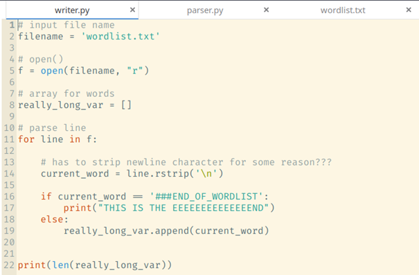
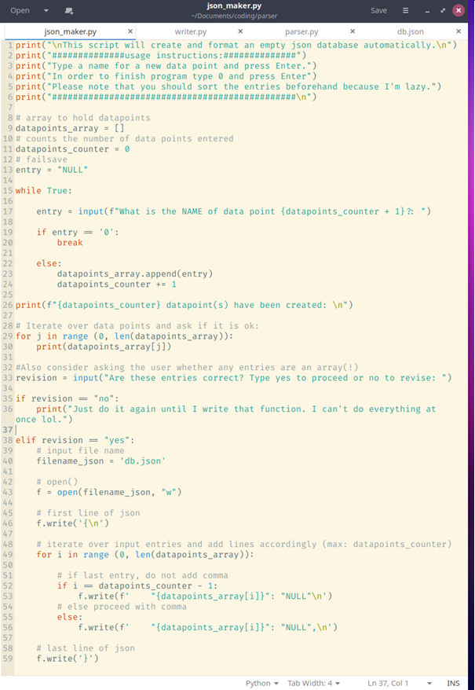
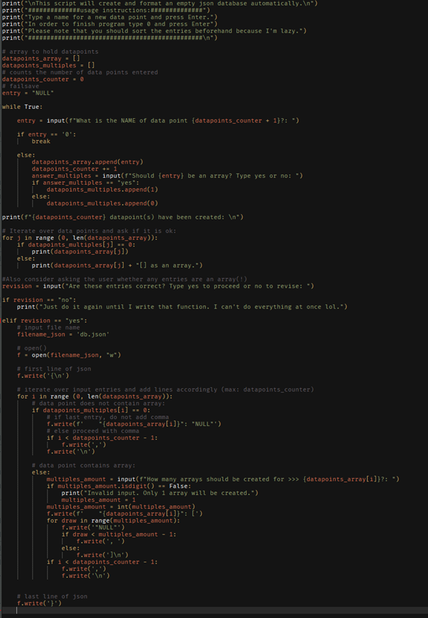

***
```python
printf("My developer diary.\n");
```
***

Today, my replacement mouse-wheel arrived (ordered from China around 3 weeks ago) unfortunately it was broken. I have contacted the seller asking for replacement and refund :) Monitor arms on Amazon are on Sale and I'm ordering one. I have looked at whiteboards at the same time but haven't found anything that's appealed to me a lot. I think what I'm looking for is a mix of whiteboards and possible a bunch of magnetic cards so I can realize future ideas other than just wasting a lot of paper. 

Seriously, my paper usage is out of control. Despite that my desk is big enough to hold a PC case, a 32inch screen and a 24inch, paper notebooks, pens and other garbage consume most of the space I'm supposed to have. While looking at the monitor stand I also looked up for productivity related cleaning up of my Desktop. I realized Windows allows you to attach folders to the task bar and have all of them readily available. I might not need a third screen afterall.

I have also been looking further into Virtual Machines yesterday before going to sleep. 

I was looking for something with full GPU acceleration but that technology is still very hardcore enthusiast and not easily accessible but it appears with a secondary, dedicated GPU I should be able to get this up and running. The spare GPU I have is a GTX 650 or something and while that should work I'm shelving that idea for another time. Come to think of it what if I had some form of box to hold my notes for future ideas. I do have a big OneNote file from when I started CS50 but I rarely use it these days. Will look into that later. 

As for education, I have just received word via e-Mail that I have passed the group assessement and have been invited to a personal interview which is going to happen next week. Eager to meet the interviewer face to face, we have talked on the phone a bunch of times and I hope we get along well.
My friend and I had a meeting about his app and we went over the baselines. He wouldn't give me things I wouldn't be able to manage and I could always come to him with questions. I would also have to sign an NDA. Him being a former IT consultant makes this an endearing offer and I accept.

15:30 on the same day

I have booted up my Ubuntu VM. The goal is to familiarize myself with node.js (practically what I had been intending to do yesterday). I want to write an app in Python that will read a pre-formatted, alphabetically sorted list of keywords (probably going to turn it into a hash table as learned in CS50 in C) and cross-check this word list with the parsed weblinks from earlier. I will first come up with a prototype solution that will ask for user input and cross-check with the word list, then i will look into python hash tables and pointers and then see from there. But first I will share my Ubuntu VirtualBox folder with Win10.

This appears to work fine with my wordlist:



I have also had an idea on how to write a j.son file script slash database creator. It's pretty basic but the general idea is:
0) If we are appending  to an existing .json file, make a backup before proceeding to manipulate it.
1) Ask the user to count how many data points are to be added to each json object.
repeat until count reached or if input is "0"
2) Proceed to ask for the name of the first data point.

print to file the neccessary formatting.
Here is what I have come up with so far:



and the second iteration of json_maker:



As for the size of the database I am considering asking the user if he knows the specific size of it beforehand but because that is unrealistic I think it is better to learn about insertion first. There is another good reason to learn insertion, namely when it comes to adding data. I think it would be best if there were a hash table of 26 buckets, possibly more, and add new users via insertion to a specific point in order to keep the list sorted alphabetically. I think it's best if I take a look on how to add a next-pointer to each users in order to keep up the alphabetical list for easier reading of the json database.
Possible entries for each object off the top of my head:
user info:
. Last Name
. First Name
. Age
. Address ------- street, city, postal code, country ........ (parse api to check validity?)
. eMail
. phone number (add multiple lines for fax etc.?)
. website
. experience level (Beginner, Intermediate, Advanced) 
	.if Intermediate/Advanced: Prompt to Upload Certification?
internal:
. Level: Teacher or Student .......................................HOOK Wizard Mode to this value
. Subscriber Status (Currently subscribed?) initiate var last_login_time to 0
	.if not subscribed, check activity:
		.if not logged on in a long time, check var last_login_time
			.if certain amount of var time has passed send friendly email reminder
